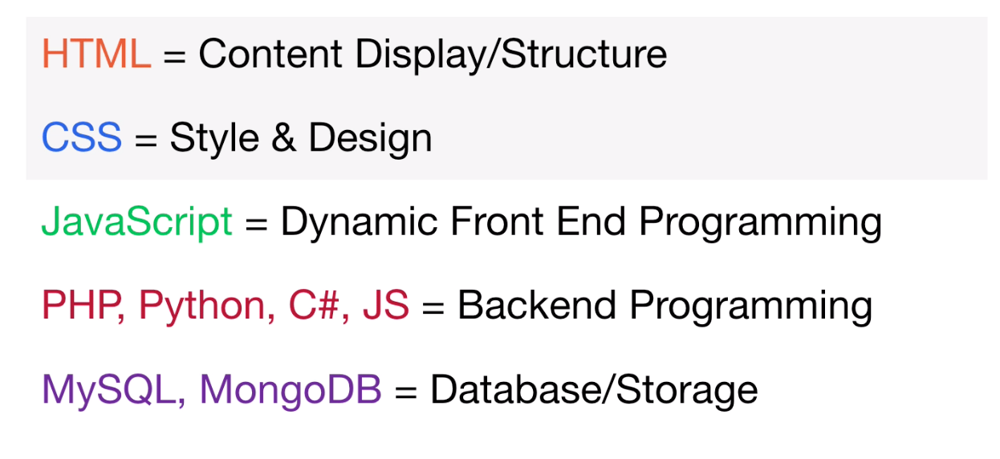

# HTML y CSS from the Beginning
This is the code for Brad Traversy's course on CSS and HTML. 

### The Internet
* A global network of computers.
* Each computer/router has an IP address `73.158.6.61`.
* Computers talk to each other using the **TCP/IP** protocol.
* **HTTP** handles web traffic (request/responses).

### Web Servers
 - **Websites/Webpages** are files stored on computers that run a piece of software called **web server** (Apache, Nginx, etc).
 - **Hosting companies** provide space on a server for your website.
 - **Domain names** can be purchased from registars and linked to your hosting account/web server.
 - **DNS** is used to map IP addresses to domain names.

### Process Of Loading A Webpage
 

## The Roles of HTML and CSS in Web Development

### What is HTML ? 
- **Hypertext Markup Language**
- HTML is __not__ a programming language.
- Markup for creating webpages / documents.
- HTML is extremely important & relevant but is also just the beginning. 
 
### What is CSS ?
- **Cascading Style Sheet**
- Styling/Stylesheet Language.
- Used for styling HTML elements.
- Can be extended with SASS/Less.

### The Roles of Web Technologies

